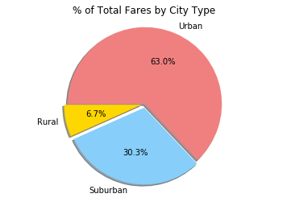

# Analysis

* Observed Trend 1 - As I expected, Pyber does most of its business in Urban areas as measured by rides and fares.
* Observed Trend 2 - While Urban areas have the most drivers by a significant amount, it appears that drivers in Rural and Suburban areas raise more money and carry out more rides because the percentages of fares and rides that Rural and Suburban drivers account for are greater than their total drivers perecentage.
* Observed Trend 3 - As the number of drivers increase, the average fare decreases. 


```python
import matplotlib.pyplot as plt
import pandas as pd
import numpy as np
```


```python
city_data = "raw_data/city_data.csv"
ride_data = "raw_data/ride_data.csv"

city_data_df = pd.read_csv(city_data)
ride_data_df = pd.read_csv(ride_data)
```


```python
city_data_df.loc[100,"city"] = "Port James 2"
```


```python
grouped_data_df = ride_data_df.groupby("city")
average_fare_df = pd.DataFrame(grouped_data_df["fare"].mean())
average_fare_df = average_fare_df.reset_index(drop=False)
```


```python
grouped_data_df = ride_data_df.groupby("city")
total_ride_df = pd.DataFrame(grouped_data_df["date"].count())
total_ride_df = total_ride_df.reset_index(drop=False)
```


```python
combined_data_df = pd.merge(average_fare_df, total_ride_df, on='city')
combined_data_df = pd.merge(combined_data_df, city_data_df, on='city')
combined_data_df
```


<div>
<style>
    .dataframe thead tr:only-child th {
        text-align: right;
    }

    .dataframe thead th {
        text-align: left;
    }

    .dataframe tbody tr th {
        vertical-align: top;
    }
</style>
<table border="1" class="dataframe">
  <thead>
    <tr style="text-align: right;">
      <th></th>
      <th>city</th>
      <th>fare</th>
      <th>date</th>
      <th>driver_count</th>
      <th>type</th>
    </tr>
  </thead>
  <tbody>
    <tr>
      <th>0</th>
      <td>Alvarezhaven</td>
      <td>23.928710</td>
      <td>31</td>
      <td>21</td>
      <td>Urban</td>
    </tr>
    <tr>
      <th>1</th>
      <td>Alyssaberg</td>
      <td>20.609615</td>
      <td>26</td>
      <td>67</td>
      <td>Urban</td>
    </tr>
    <tr>
      <th>2</th>
      <td>Anitamouth</td>
      <td>37.315556</td>
      <td>9</td>
      <td>16</td>
      <td>Suburban</td>
    </tr>
    <tr>
      <th>3</th>
      <td>Antoniomouth</td>
      <td>23.625000</td>
      <td>22</td>
      <td>21</td>
      <td>Urban</td>
    </tr>
    <tr>
      <th>4</th>
      <td>Aprilchester</td>
      <td>21.981579</td>
      <td>19</td>
      <td>49</td>
      <td>Urban</td>
    </tr>
    <tr>
      <th>5</th>
      <td>Arnoldview</td>
      <td>25.106452</td>
      <td>31</td>
      <td>41</td>
      <td>Urban</td>
    </tr>
    <tr>
      <th>6</th>
      <td>Campbellport</td>
      <td>33.711333</td>
      <td>15</td>
      <td>26</td>
      <td>Suburban</td>
    </tr>
    <tr>
      <th>7</th>
      <td>Carrollbury</td>
      <td>36.606000</td>
      <td>10</td>
      <td>4</td>
      <td>Suburban</td>
    </tr>
    <tr>
      <th>8</th>
      <td>Carrollfort</td>
      <td>25.395517</td>
      <td>29</td>
      <td>55</td>
      <td>Urban</td>
    </tr>
    <tr>
      <th>9</th>
      <td>Clarkstad</td>
      <td>31.051667</td>
      <td>12</td>
      <td>21</td>
      <td>Suburban</td>
    </tr>
    <tr>
      <th>10</th>
      <td>Conwaymouth</td>
      <td>34.591818</td>
      <td>11</td>
      <td>18</td>
      <td>Suburban</td>
    </tr>
    <tr>
      <th>11</th>
      <td>Davidtown</td>
      <td>22.978095</td>
      <td>21</td>
      <td>73</td>
      <td>Urban</td>
    </tr>
    <tr>
      <th>12</th>
      <td>Davistown</td>
      <td>21.497200</td>
      <td>25</td>
      <td>25</td>
      <td>Urban</td>
    </tr>
    <tr>
      <th>13</th>
      <td>East Cherylfurt</td>
      <td>31.416154</td>
      <td>13</td>
      <td>9</td>
      <td>Suburban</td>
    </tr>
    <tr>
      <th>14</th>
      <td>East Douglas</td>
      <td>26.169091</td>
      <td>22</td>
      <td>12</td>
      <td>Urban</td>
    </tr>
    <tr>
      <th>15</th>
      <td>East Erin</td>
      <td>24.478214</td>
      <td>28</td>
      <td>43</td>
      <td>Urban</td>
    </tr>
    <tr>
      <th>16</th>
      <td>East Jenniferchester</td>
      <td>32.599474</td>
      <td>19</td>
      <td>22</td>
      <td>Suburban</td>
    </tr>
    <tr>
      <th>17</th>
      <td>East Leslie</td>
      <td>33.660909</td>
      <td>11</td>
      <td>9</td>
      <td>Rural</td>
    </tr>
    <tr>
      <th>18</th>
      <td>East Stephen</td>
      <td>39.053000</td>
      <td>10</td>
      <td>6</td>
      <td>Rural</td>
    </tr>
    <tr>
      <th>19</th>
      <td>East Troybury</td>
      <td>33.244286</td>
      <td>7</td>
      <td>3</td>
      <td>Rural</td>
    </tr>
    <tr>
      <th>20</th>
      <td>Edwardsbury</td>
      <td>26.876667</td>
      <td>27</td>
      <td>11</td>
      <td>Urban</td>
    </tr>
    <tr>
      <th>21</th>
      <td>Erikport</td>
      <td>30.043750</td>
      <td>8</td>
      <td>3</td>
      <td>Rural</td>
    </tr>
    <tr>
      <th>22</th>
      <td>Eriktown</td>
      <td>25.478947</td>
      <td>19</td>
      <td>15</td>
      <td>Urban</td>
    </tr>
    <tr>
      <th>23</th>
      <td>Floresberg</td>
      <td>32.310000</td>
      <td>10</td>
      <td>7</td>
      <td>Suburban</td>
    </tr>
    <tr>
      <th>24</th>
      <td>Fosterside</td>
      <td>23.034583</td>
      <td>24</td>
      <td>69</td>
      <td>Urban</td>
    </tr>
    <tr>
      <th>25</th>
      <td>Hernandezshire</td>
      <td>32.002222</td>
      <td>9</td>
      <td>10</td>
      <td>Rural</td>
    </tr>
    <tr>
      <th>26</th>
      <td>Horneland</td>
      <td>21.482500</td>
      <td>4</td>
      <td>8</td>
      <td>Rural</td>
    </tr>
    <tr>
      <th>27</th>
      <td>Jacksonfort</td>
      <td>32.006667</td>
      <td>6</td>
      <td>6</td>
      <td>Rural</td>
    </tr>
    <tr>
      <th>28</th>
      <td>Jacobfort</td>
      <td>24.779355</td>
      <td>31</td>
      <td>52</td>
      <td>Urban</td>
    </tr>
    <tr>
      <th>29</th>
      <td>Jasonfort</td>
      <td>27.831667</td>
      <td>12</td>
      <td>25</td>
      <td>Suburban</td>
    </tr>
    <tr>
      <th>...</th>
      <td>...</td>
      <td>...</td>
      <td>...</td>
      <td>...</td>
      <td>...</td>
    </tr>
    <tr>
      <th>95</th>
      <td>South Roy</td>
      <td>26.031364</td>
      <td>22</td>
      <td>35</td>
      <td>Urban</td>
    </tr>
    <tr>
      <th>96</th>
      <td>South Shannonborough</td>
      <td>26.516667</td>
      <td>15</td>
      <td>9</td>
      <td>Suburban</td>
    </tr>
    <tr>
      <th>97</th>
      <td>Spencertown</td>
      <td>23.681154</td>
      <td>26</td>
      <td>68</td>
      <td>Urban</td>
    </tr>
    <tr>
      <th>98</th>
      <td>Stevensport</td>
      <td>31.948000</td>
      <td>5</td>
      <td>6</td>
      <td>Rural</td>
    </tr>
    <tr>
      <th>99</th>
      <td>Stewartview</td>
      <td>21.614000</td>
      <td>30</td>
      <td>49</td>
      <td>Urban</td>
    </tr>
    <tr>
      <th>100</th>
      <td>Swansonbury</td>
      <td>27.464706</td>
      <td>34</td>
      <td>64</td>
      <td>Urban</td>
    </tr>
    <tr>
      <th>101</th>
      <td>Thomastown</td>
      <td>30.308333</td>
      <td>24</td>
      <td>1</td>
      <td>Suburban</td>
    </tr>
    <tr>
      <th>102</th>
      <td>Tiffanyton</td>
      <td>28.510000</td>
      <td>13</td>
      <td>21</td>
      <td>Suburban</td>
    </tr>
    <tr>
      <th>103</th>
      <td>Torresshire</td>
      <td>24.207308</td>
      <td>26</td>
      <td>70</td>
      <td>Urban</td>
    </tr>
    <tr>
      <th>104</th>
      <td>Travisville</td>
      <td>27.220870</td>
      <td>23</td>
      <td>37</td>
      <td>Urban</td>
    </tr>
    <tr>
      <th>105</th>
      <td>Vickimouth</td>
      <td>21.474667</td>
      <td>15</td>
      <td>13</td>
      <td>Urban</td>
    </tr>
    <tr>
      <th>106</th>
      <td>Webstertown</td>
      <td>29.721250</td>
      <td>16</td>
      <td>26</td>
      <td>Suburban</td>
    </tr>
    <tr>
      <th>107</th>
      <td>West Alexis</td>
      <td>19.523000</td>
      <td>20</td>
      <td>47</td>
      <td>Urban</td>
    </tr>
    <tr>
      <th>108</th>
      <td>West Brandy</td>
      <td>24.157667</td>
      <td>30</td>
      <td>12</td>
      <td>Urban</td>
    </tr>
    <tr>
      <th>109</th>
      <td>West Brittanyton</td>
      <td>25.436250</td>
      <td>24</td>
      <td>9</td>
      <td>Urban</td>
    </tr>
    <tr>
      <th>110</th>
      <td>West Dawnfurt</td>
      <td>22.330345</td>
      <td>29</td>
      <td>34</td>
      <td>Urban</td>
    </tr>
    <tr>
      <th>111</th>
      <td>West Evan</td>
      <td>27.013333</td>
      <td>12</td>
      <td>4</td>
      <td>Suburban</td>
    </tr>
    <tr>
      <th>112</th>
      <td>West Jefferyfurt</td>
      <td>21.072857</td>
      <td>21</td>
      <td>65</td>
      <td>Urban</td>
    </tr>
    <tr>
      <th>113</th>
      <td>West Kevintown</td>
      <td>21.528571</td>
      <td>7</td>
      <td>5</td>
      <td>Rural</td>
    </tr>
    <tr>
      <th>114</th>
      <td>West Oscar</td>
      <td>24.280000</td>
      <td>29</td>
      <td>11</td>
      <td>Urban</td>
    </tr>
    <tr>
      <th>115</th>
      <td>West Pamelaborough</td>
      <td>33.799286</td>
      <td>14</td>
      <td>27</td>
      <td>Suburban</td>
    </tr>
    <tr>
      <th>116</th>
      <td>West Paulport</td>
      <td>33.278235</td>
      <td>17</td>
      <td>5</td>
      <td>Suburban</td>
    </tr>
    <tr>
      <th>117</th>
      <td>West Peter</td>
      <td>24.875484</td>
      <td>31</td>
      <td>61</td>
      <td>Urban</td>
    </tr>
    <tr>
      <th>118</th>
      <td>West Sydneyhaven</td>
      <td>22.368333</td>
      <td>18</td>
      <td>70</td>
      <td>Urban</td>
    </tr>
    <tr>
      <th>119</th>
      <td>West Tony</td>
      <td>29.609474</td>
      <td>19</td>
      <td>17</td>
      <td>Suburban</td>
    </tr>
    <tr>
      <th>120</th>
      <td>Williamchester</td>
      <td>34.278182</td>
      <td>11</td>
      <td>26</td>
      <td>Suburban</td>
    </tr>
    <tr>
      <th>121</th>
      <td>Williamshire</td>
      <td>26.990323</td>
      <td>31</td>
      <td>70</td>
      <td>Urban</td>
    </tr>
    <tr>
      <th>122</th>
      <td>Wiseborough</td>
      <td>22.676842</td>
      <td>19</td>
      <td>55</td>
      <td>Urban</td>
    </tr>
    <tr>
      <th>123</th>
      <td>Yolandafurt</td>
      <td>27.205500</td>
      <td>20</td>
      <td>7</td>
      <td>Urban</td>
    </tr>
    <tr>
      <th>124</th>
      <td>Zimmermanmouth</td>
      <td>28.301667</td>
      <td>24</td>
      <td>45</td>
      <td>Urban</td>
    </tr>
  </tbody>
</table>
<p>125 rows × 5 columns</p>
</div>


# Bubble Plot of Ride Sharing Data


```python
urban_df = combined_data_df.loc[combined_data_df["type"]=="Urban",:]
urban_x = urban_df["date"]
urban_y = urban_df["fare"]
urban_size = urban_df["driver_count"]

suburban_df = combined_data_df.loc[combined_data_df["type"]=="Suburban",:]
suburban_x = suburban_df["date"]
suburban_y = suburban_df["fare"]
suburban_size = suburban_df["driver_count"]

rural_df = combined_data_df.loc[combined_data_df["type"]=="Rural",:]
rural_x = rural_df["date"]
rural_y = rural_df["fare"]
rural_size = rural_df["driver_count"]
```


```python
urban_handle = plt.scatter(urban_x, urban_y, marker ='o', color='lightcoral', edgecolors="black", label="Urban", s=urban_size*5, alpha=.5)
suburban_handle = plt.scatter(suburban_x, suburban_y, marker='o', color='lightskyblue', edgecolors="black", label="Suburban", s=suburban_size*5, alpha=.5)
rural_handle = plt.scatter(rural_x, rural_y, marker='o', color='gold', edgecolors="black", label="Rural", s=rural_size*5, alpha=.5)

plt.legend(handles=[urban_handle, suburban_handle, rural_handle], loc="best")

plt.ylim(10,60)
plt.xlim(0,40)
plt.title("Pyber Ride Sharing Data (2016)")
plt.xlabel("Total Number of Rides (Per City)")
plt.ylabel("Average Fare($)")
plt.show()
```


# Total Fares by City Type


```python
combined_data_df = pd.merge(ride_data_df, city_data_df, how='outer', on='city')

grouped_combined_data_df = combined_data_df.groupby("type")
members = grouped_combined_data_df["fare"].sum()

city_types = ["Rural","Suburban","Urban"]

colors = ["gold", "lightskyblue", "lightcoral"]
explode = (0.05, 0.05, 0)

plt.title("% of Total Fares by City Type")
plt.pie(members, explode=explode, labels=city_types, colors=colors, autopct="%1.1f%%", shadow=True, startangle=180)
plt.axis("equal")
plt.show()
```





# Total Rides by City Type


```python
combined_data_df = pd.merge(ride_data_df, city_data_df, how='outer', on='city')

grouped_combined_data_df = combined_data_df.groupby("type")
members = grouped_combined_data_df["date"].count()

city_types = ["Rural","Suburban","Urban"]

colors = ["gold", "lightskyblue", "lightcoral"]
explode = (0.05, 0.05, 0)

plt.title("% of Total Rides by City Type")
plt.pie(members, explode=explode, labels=city_types, colors=colors, autopct="%1.1f%%", shadow=True, startangle=180)
plt.axis("equal")
plt.show()
```


# Total Drivers by City Type


```python
grouped_data_df = city_data_df.groupby("type")
members = grouped_data_df["driver_count"].sum()

city_types = ["Rural","Suburban","Urban"]

colors = ["gold", "lightskyblue", "lightcoral"]
explode = (0.05, 0.05, 0)

plt.title("% of Total Drivers by City Type")
plt.pie(members, explode=explode, labels=city_types, colors=colors, autopct="%1.1f%%", shadow=True, startangle=180)
plt.axis("equal")
plt.show()
```


